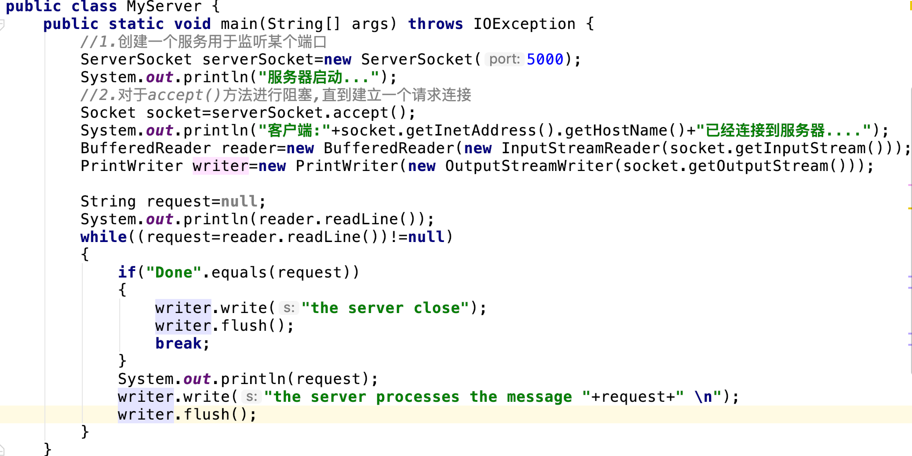

# Netty in Action
## Netty-异步和事件驱动
 Netty 是一款异步的事件驱动的网络应用程序框架，支持快速地开发可维护的高性能的

 面向协议的服务器和客户端。
### Java网络编程
 一般的Java网络编程:

 ServerSocket上的accept()方法将会一直阻塞到一个连接建立，随后返回一个新的Socket用于客户端和服务器之间的通信。

 该ServerSocket将继续监听传入的连接。

 BufferedReader和PrintWriter都衍生自Socket的输入输出流。前者从一个

 字符输入流中读取文本，后者打印对象的格式化的表示到文本输出流。readLine()方法将会阻塞，直到在处一个由换行符或者回车符结尾的字符串被读取。

 客户端的请求已经被处理 。
 
 这段代码片段将只能同时处理一个连接，要管理多个并发客户端，需要为每个新的客户端
   
 Socket创建一个新的Thread。
 
 让我们考虑一下这种方案的影响。第一，在任何时候都可能有大量的线程处于休眠状态，只是等待输入或者输出数据就绪，这可能算是一种资源浪费。
 
 第二，需要为每个线程的调用栈都分配内存，其默认值大小区间为64KB到1MB，具体取决于操作系统。
 
 第三，即使Java虚拟机(JVM)在物理上可以支持非常大数量的线程，但是远在到达该极限之前，上下文切换所带来的开销就会带来麻烦。
 
#### Java NIO
 新的还是非阻塞的
 
 NIO 最开始是新的输入/输出(New Input/Output)的英文缩写，但是，该Java API已经出现足够长的时间了，
 
 不再是“新的”了，因此，如今大多数的用户认为 NIO 代表非阻塞 I/O(Non-blocking I/O)，
 
 而阻塞 I/O(blocking I/O)是旧的输入/输出(old input/output，OIO)。
 
 你也可能遇到它被称为普通 I/O(plain I/O)的时候。
 
#### 选择器
 